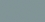

Color palette
=============

Notorious uses the [Solarized color palette](https://github.com/altercation/solarized),
this file contains a simplified textual representation for quick reference:

|Name    |RGB        |HEX    |Sample                     |
|--------|-----------|-------|---------------------------|
|*Base 0*|131,148,150|#839496||
