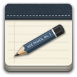

Notorious
=========

Simple, fast, modular and glorified text editor built using web technologies
(HTML5, CSS3, JavaScript, Webkit, NodeJS).

How does this differ from Brackets?
-----------------------------------

Differently than [Brackets](http://brackets.io), creating a full-fledged IDE
targeted at a specific group is not a goal for this project; Notorious' roots
are in Vim and SublimeText rather than in Eclipse, i.e. it's meant to be a
fast, good looking, extendable text editor with a keyboard-centric interface
and no bias towards any specific language or stack.

The focus is on delivering a great experience and a boost in productivity for
those writers and developers that find having to resort to the mouse in order
to operate their main tool less than optimal.
